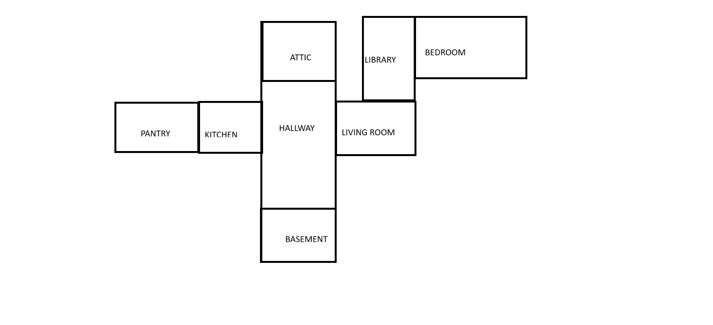

# Haunted House
A python based text game. Explore different rooms while collecting items and completing challenges from characters!

## How does the game work?
The user can type the following commands:<br>
```go {direction}```: Go to a different room based on the specified directions.<br>
```look```: Gives the description of the room the user is in. Also provides the list of items in that room.<br>
```take {item}```: Take the item which is present in the room.<br>
```talk {character}```: Talk to the specified npcs.<br>
```inventory```: Returns the contents of the inventory.<br>
```unlock```: Unlocks the treasure box if conditions are met.<br>
```quit```: Ends the game.

## Description of NPCs
The game has the following NPCs:

1. Ghost: A translucent figure floats in front of you.
2. Witch: A wicked witch stands before you.
3. Knight: A brave knight in shining armor awaits your arrival
4. Sorcerer: A mysterious sorcerer with a pointed hat stands here

## Description of the rooms
The game has the following rooms:

1. Hallway: You are in a dark and spooky hallway
2. Kitchen: You are in a dusty old kitchen with cobwebs
3. Pantry: You are in a small pantry filled with shelves
4. Living Room: You are in a creepy living room with creaky furniture
5. Library: You are in a dimly lit library filled with old books
6. Bedroom: You are in a spooky bedroom with a large, unmade bed
7. Basement: You are in a dimly lit basement with a musty smell
8. Attic: You are in a dusty attic filled with old furniture and cobwebs 

## Layout of the haunted house
This is the path to the .png file which illustrates the layout of the haunted house: 

## Goal of the Game
Find the treasure box in one of the rooms. Score maximum points by completing challenges and collecting items.

## How to start?

- Fork the Repository
- Have a look at issues with hacktoberfest tag!
- Clone The Repository and move inside it 
``` git clone https://github.com/IEEE-VIT/Haunted_House && cd Haunted_House```
- Make and activate a virtual env.
- Install the requirements ```pip install -r requirements.txt```
- Open python terminal and download the following nltk packages <br>
```nltk.download('punkt')```<br>
```nltk.download('stopwords')```<br>
```nltk.download('wordnet')```<br>
- Create a new branch with your feature name
``` git branch <name>```
- Commit your changes
- Push the changes to your fork!
``` git add . ```
```git commit -m "Your feature description"```
```git push origin <your branch name>```

- All set, Feel free to contribute and send a Pull Request
- Wait for your PR to be reviewed and merged
- For more info on how to contribute check out <a href="https://github.com/IEEE-VIT/Haunted_House/blob/main/CONTRIBUTING.md">```CONTRIBUTING.md```</a>

